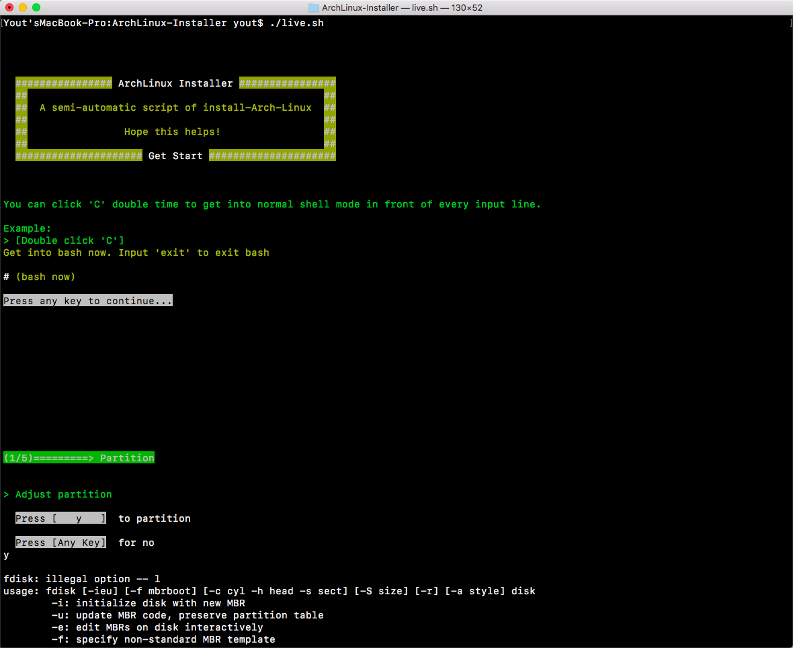
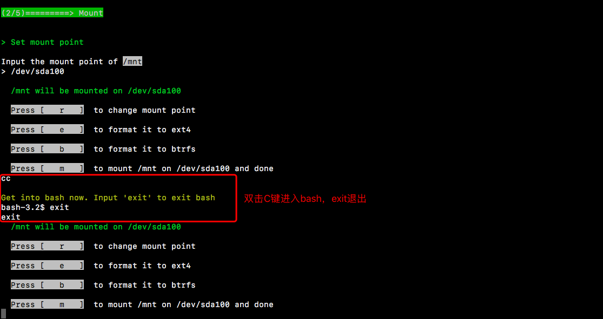
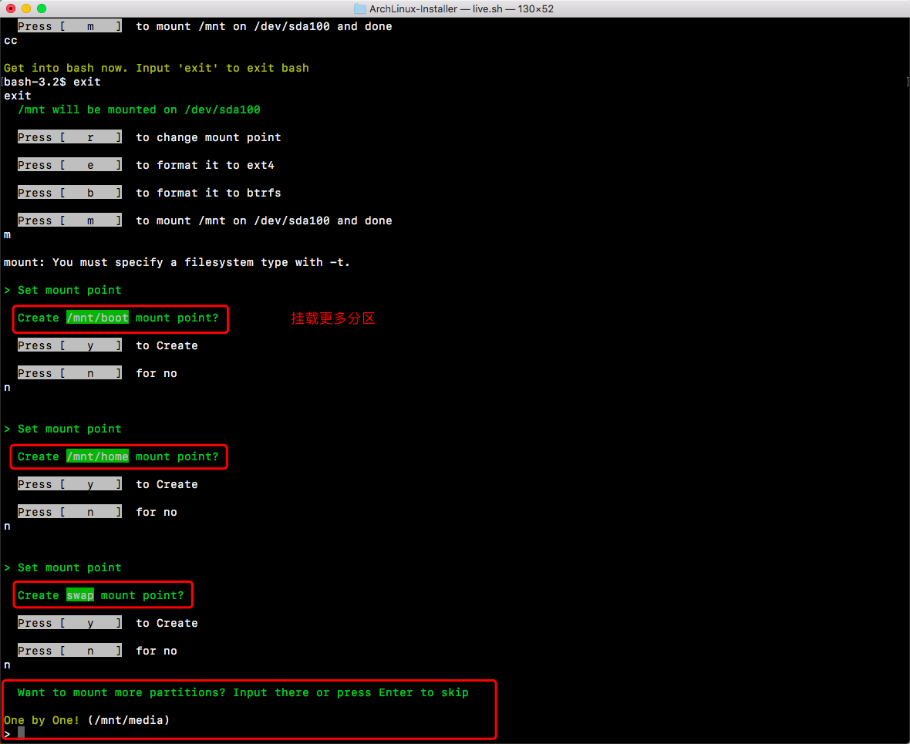
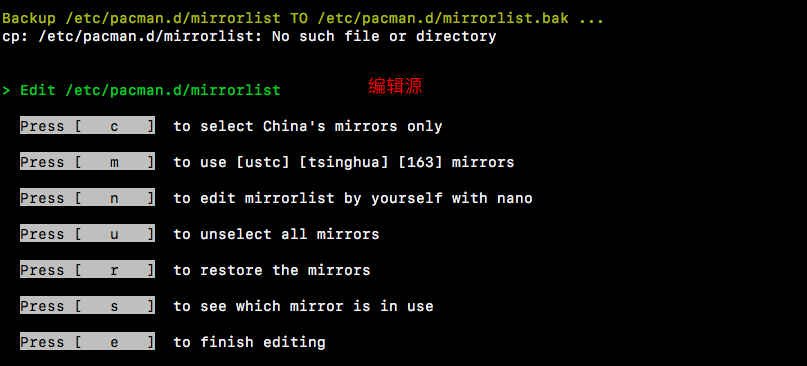

## 一个稍微“比较美观”的ArchLinux安装脚本 ##
参考[Wiki](https://wiki.archlinux.org)的[Installation guide](https://wiki.archlinux.org/index.php/Installation_guide)，以及[YangMame](https://github.com/yangmame)的[Arch-Installer](https://github.com/yangmame/Arch-Installer)


---


### 主要功能 ###
- 在输入位置双击“C”键进入bash
   非长文本输入时有效（长文本输入行有'> '标识）
- 分区、mount
- 根据需要修改/etc/pacman.d/mirrorlist
- 安装桌面环境
- 支持Intel/NVIDIA/ATI，以及双显卡
- 配置AUR源


---


### 使用 ###
联网后
```
wget raw.githubusercontent.com/youthug/ArchLinux-Installer/master/live.sh
#或者使用短链 wget git.io/vA646 -O live.sh
chmod +x lice.sh
./live.sh
```


---


### 截图 ###
截图环境为mac，部分命令无法识别





进入bash  



挂载分区  



修改源  



---


### 欢迎反馈使用体验以及未知BUG。。。 ###

